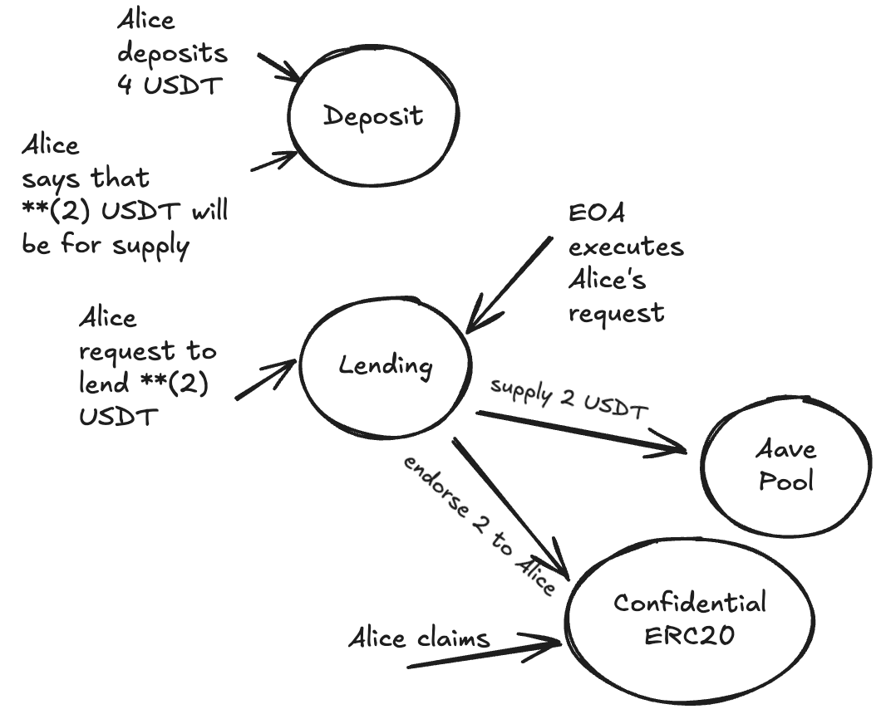

## Confidential Layer for Lending Protocols

This project implements a confidential layer for lending protocols using fhEVM (Fully Homomorphic Ethereum Virtual Machine). It allows users to deposit and withdraw assets while maintaining privacy of their loan amounts when interacting with existing DeFi lending protocols.

### Project Structure

```
├── contracts/                 # Smart contracts
│   ├── ConfidentialLending.sol    # Main lending protocol contract
│   ├── ConfidentialLendingToken.sol # Token contract for the protocol
│   ├── Deposit.sol                # Deposits management contract
│   ├── utils/                     # Utility contracts
│   └── mocks/                     # Mock contracts for testing
├── scripts/                   # Deployment and interaction scripts
│   ├── interactiveScript.ts   # Interactive script for contract interaction
│   └── utils.ts               # Utility functions
├── test/                      # Test files
├── deployments/               # Deployment artifacts
├── deploy/                    # Deployment scripts
└── hardhat.config.ts          # Hardhat configuration
```

### Solution Architecture

The solution consists of three main components:

1. **ConfidentialLending.sol**
   - Main contract that handles the confidential lending operations
   - Implements fhEVM for privacy-preserving computations
   - Interfaces with external lending protocols (Aave on this case)

2. **ConfidentialLendingToken.sol**
   - Confidential ERC20 token representing user deposits
   - Used for tracking user positions in the protocol

3. **Deposit.sol**
   - Handles the deposit and withdrawal operations
   - Manages the encryption and decryption of amounts
   - Ensures privacy of user transactions
   - Used for obfuscate the amount of non confidential tokens that user is lending

The architecture follows a modular design where:
1. The user deposits a public amount of tokens in the Deposit contract
2. The user designs that an unknown portion of the tokens will be supplied for lending
3. Makes a request on the Lending contract to supply an unknown amount of tokens on aave
4. The user from a different address, (or any other EOA or off chain sequencer), processes the request
5. When the user request is done, some Confidential ERC20 will be endorsed to its address and will be able to claim them.



### Deployment Addresses

Confidential lending: 0x8a273125d9b1986328422672924e97830e88Bd1f
Deposit:
ConfidentialERC20:

###  Interacting with Contracts

To interact with the deployed contracts:
```bash
pnpm install
```

2. Set up your environment variables:
```bash
cp .env.example .env
# Edit .env with your private keys and network configuration
```

1. Run the interactive script:
```bash
pnpm interactive
```
This script will help to execute needed operations. It will ask for needed values and print the result in case of getter functions or the transaction hash to check the operation.

Note that for some getter operation you will have to provide the value cryptographic handle instead of the value, this will happen with both user's address and request id, I didn't found how to build this handle using fhevmjs.

I have been getting those values from the events emitted on the previous tx, I mean for getting the user address handle for the deposit, I inspect the tx events and get the handle from there.


Example:
1. deposit 10 Aave tokens https://sepolia.etherscan.io/tx/0xe50b31e4ce64be193bd4e7dba83b90a83a1ebd38ab961e5af5adf513c00f2b61
2. supply 3 Aave tokens  https://sepolia.etherscan.io/tx/0xe219d047fe1a59efa985aaac3ba95c4870c1e05180e1ec74e2fbb5b79ac18a29
3. request supply of 2 Aave tokens  https://sepolia.etherscan.io/tx/0x9c1031516724bb4a426e59361574df736a556dee9bc2d224db13e76779b2a030
4. process the request by same EOA https://sepolia.etherscan.io/tx/0xffcd60c33a00b7d8158417938608bcac3de7f77ccf9f0df5c0ccbc20de57cc7c
5. request supply of 1 Aave token https://sepolia.etherscan.io/tx/0x3ebfd7984671f4442519453934e2919e13c21f9fcd12ba059571aed8fff683a3
6. process the request by another EOA https://sepolia.etherscan.io/tx/0x6de5c9819de288ee5090c0910bad816364e81a64a74ac8e634e4f944e67bc729
7. claim 3 confidential lending tokens https://sepolia.etherscan.io/tx/0xa9bc11f87b6af7bb0a928601d50ea0f0e666166d928bed3d3193e35287757e39

At this point the deposit contract will have the Aave lending tokens and the user the confidential lending tokens those tokens and the supplied tokens were transferred to AAve pool.


## 🛠 Improvements
No UI due to time constraints:
Due to limited time, I wasn't able to implement a full UI. As a workaround, an interactive script was created to allow users to execute core transactions and interact with the protocol directly.

Limited lending functionalities:
Lending features beyond supplying were not implemented. I thought about functionalities like borrowing and revenue sharing and how they should work on current architecture and realized that these would be challenging since all positions are centralized in a single token contract, the Deposit. The revenue sharing could be solved by managing also on this repo the shares based on Aave profit formulas but it will increase complexity and could have some edge scenarios.

A more modular and privacy-preserving approach is to deploy a confidential smart account per user (EOA). These accounts would act as intermediaries, fully controlled by their respective users, while the protocol maintains a confidential mapping between EOAs and their accounts. This architecture would simplify tracking positions, decentralize state, and facilitate better revenue distribution mechanisms.

Unfinished code and TODOs:
Some parts of the implementation remain incomplete or contain TODOs, largely due to both time limitations and knowledge gaps around fhEVM.
For example, in the supply callback logic, I wasn't sure how to properly handle conditional logic with encrypted inputs, such as reverting or returning decrypted comparison results. Since it’s unclear whether this is currently supported by fhEVM or not I also explored different options.

Design-first focus:
Rather than prioritizing a breadth of features, I prioritized establishing a solid architectural foundation for obfuscating users and balances. I believe this is the most complex and valuable aspect of the challenge. Once this foundation is solid, extending the protocol with additional functionalities becomes more straightforward.

Improve Tokenization:
Currently, a cToken is endorsed to the user based on the number of assets supplied to the protocol, it follows the idea of aToken, the interest-bearing token of Aave. Since the aTokens are granted to the Deposit contract these cTokens help to know the positions distribution among the users. However, they are pegged 1:1 to any asset deposited on the protocol and different assets might have different prices, so this should be fixed either by having cToken for each different asset or endorsing different amounts.

Note that this issue is only to the current design if going with having confidential smart accounts for users, this might not be needed since that account controlled by the user EOA will actually have the aTokens, not the Deposit contract.

Future improvements:
While Permit([ERC-2612](https://eips.ethereum.org/EIPS/eip-2612)) could help in this problem, I didn't focus on it since most of ERC20 doesn't support it. However, Permit2 seems a more promising path that could be explored since it works for all ERC20, didn't explore it due to the lack of previous knowledge about it and the tight deadline. EIP-7702 which will be included in the next Pectra fork is also worth exploring.


## Deployment:
- Lending contract: 0xE8Ee37A893f2403d3e83D8Eb22Fb4a707D1AAA5e
- Deposit contract: 0x1Cf234DC4aD51491dd90a2A01c2c29B1Ba411f32
- Confidential Lending Token: 0xE080844cAD6C0eCCF07B68516Cb8982757dd6FD3